# writing_with_ai

> 医療者向け「AI × Markdown × GitHub」で英語論文を書くスターターキット

このリポジトリは、英語論文を書くことが苦手な医療者が、AIツール（GitHub CopilotやClaude）とテンプレートを活用して、効率的に臨床医学論文を執筆できるようにすることを目的としています。

## 🚀 クイックスタート (10分)

1. **リポジトリをクローン**
   ```bash
   git clone https://github.com/SRWS-PSG/writing_with_ai.git
   cd writing_with_ai
   ```

2. **テンプレートを選択**
   - `templates/`ディレクトリから適切なテンプレートをコピー
   - 例: `cp templates/results_first_template.md my_paper.md`

3. **VS Codeで開く**
   ```bash
   code my_paper.md
   ```

4. **ビルド実行**
   - `Ctrl+Shift+B`でビルドタスクを実行
   - 生成されたdocxファイルを確認

## 🗺️ リポジトリマップ

```
writing_with_ai/
├── docs/                # 読むだけで理解できる学習ガイド
│   ├── 00_overview.md   # サイトマップ & 学習ルート
│   ├── 01_markdown.md   # Markdown 超入門
│   ├── 02_ai_workflow.md # AIを活用した執筆ワークフロー
│   ├── 03_git_gov.md    # ブランチ/PR 運用 & CODEOWNERS
│   └── _assets/         # 画像・動画
├── templates/           # そのままコピーして使う雛形
│   ├── imrad_full.md    # IMRaD形式の論文テンプレート
│   ├── results_first_template.md # 結果から投稿への道のりテンプレート
│   └── letter_to_editor.md # 編集者への手紙テンプレート
├── scripts/             # 補助スクリプト
│   └── build.sh         # ビルドスクリプト
├── .vscode/             # VS Code設定
│   ├── tasks.json       # ビルド・リント・スペルチェックタスク
│   └── copilot-chat.json # Copilotチャットスニペット
├── .github/             # GitHub関連設定
│   ├── workflows/       # CI/CDワークフロー
│   └── PULL_REQUEST_TEMPLATE.md # PRテンプレート
├── resources/           # 各種リソース
│   ├── csl/             # 引用スタイル
│   └── prompts/         # AIプロンプトライブラリ
└── README.md            # はじめに + 最短10分で動かす手順
```

## 📚 ステップバイステップガイド

詳細な使い方は以下のドキュメントを参照してください：

1. [リポジトリ概要とガイド](docs/00_overview.md)
2. [Markdown基礎](docs/01_markdown.md)
3. [AIを活用した執筆ワークフロー](docs/02_ai_workflow.md)
4. [Gitとガバナンス](docs/03_git_gov.md)

## 🤖 AIワークフロー チートシート

「結果から投稿への道のり」アプローチに基づいた執筆ワークフロー：

```mermaid
graph LR
  A[結果の整理] -->|ボトムラインメッセージ| B(結果セクション)
  B --> C(方法セクション)
  C --> D(考察セクション)
  D --> E(背景セクション)
  E --> F(要旨)
  F --> G[最終原稿]
  
  style A fill:#f9f9f9,stroke:#333,stroke-width:1px
  style B fill:#e1f5fe,stroke:#0288d1,stroke-width:1px
  style C fill:#e8f5e9,stroke:#388e3c,stroke-width:1px
  style D fill:#fff3e0,stroke:#f57c00,stroke-width:1px
  style E fill:#f3e5f5,stroke:#7b1fa2,stroke-width:1px
  style F fill:#e8eaf6,stroke:#3f51b5,stroke-width:1px
  style G fill:#fce4ec,stroke:#e91e63,stroke-width:1px
```



各ステップでのAIツール活用ポイント：
- **結果の整理**: [section_outline.prompt](resources/prompts/section_outline.prompt)を使用
- **結果セクション**: [stats2sentence.prompt](resources/prompts/stats2sentence.prompt)を使用
- **文章洗練**: [refinement.prompt](resources/prompts/refinement.prompt)を使用

詳細は[AIを活用した執筆ワークフロー](docs/02_ai_workflow.md)を参照してください。

## 🛠️ ビルド & リントコマンド

VS Codeでは以下のタスクが利用可能です：

- **ビルド**: `Ctrl+Shift+B` - Markdownファイルをdocxに変換
- **リント**: `Tasks: Run Task` → `lint-md` - Markdownの文法チェック
- **スペルチェック**: `Tasks: Run Task` → `spell-check` - スペルチェック

コマンドラインからは以下のように実行できます：

```bash
# 単一ファイルのビルド
./scripts/build.sh your_paper.md

# すべてのテンプレートをビルド
./scripts/build.sh --all
```

## 🙋‍♂️ FAQ

### Pandocのインストール方法は？

```bash
# Ubuntuの場合
sudo apt-get install pandoc

# macOSの場合
brew install pandoc

# Windowsの場合
choco install pandoc
```

### 引用文献が正しく処理されません

以下を確認してください：

1. YAMLフロントマターに`bibliography`と`csl`が正しく設定されているか
2. Pandocコマンドに`--citeproc`オプションが指定されているか

```bash
pandoc paper.md --citeproc -o paper.docx
```

### VS Codeの推奨拡張機能は？

- Markdown All in One
- markdownlint
- Pandoc Citer
- GitHub Copilot
- GitHub Copilot Chat

詳細は[VS Codeのインストール方法](docs/vs_code_installation.md)を参照してください。

## 貢献について

このリポジトリへの貢献を歓迎します。改善案やバグ報告は、Issueを作成するか、Pull Requestを送信してください。
