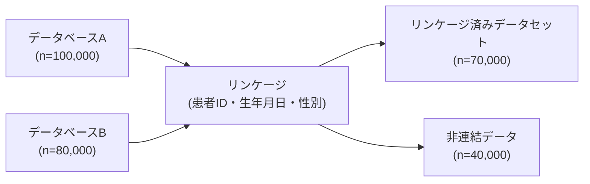
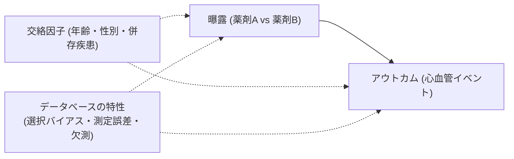

<!-- レジストリ・データベース研究プロトコルテンプレート (Markdown) -->
<!-- Generated on 2025-04-21 -->

---

bibliography: templates\observational study\retrospective_observational_protocol_references.bib
csl: templates/vancouver-brackets.csl

---

> **注意**  
> このテンプレートは「医療データベース/レジストリを用いた観察研究」を対象としています。  
> 黒字部分は原則そのまま使用してください。  
> ">"で入っているコメントはあとで全部削除してください。
> 略語の初出ではフルスペル（日本語訳を含む）を記載してください。  
> STROBE 声明・RECORD ステートメント・最新の倫理指針などのガイドラインに準拠してください。  
> 文献の引用はすべて本文中に Pandoc 形式（例：[@strobe2007]）で記載し、末尾の参考文献リストに対応するエントリを置いてください。

<!--
AI INSTRUCTION:
※この書式のコメントブロックは文書生成時に自動的に削除されます。ヒトは無視してください。
-->

# 研究課題名

> 記載例: ○○○○ データベースを用いた △△△△ の検証：後向きコホート研究  
> 注意事項: 研究課題名は具体的かつ簡潔に。対象疾患・使用するデータベース名・地理的範囲・研究デザインを含める。  
> RECORD ステートメント項目 1.1-1.3: タイトルにはデータ種類、データベース名、地理的範囲、実施期間を明記し、データベース間のリンケージを行う場合はその旨も記載する。

研究責任者所属：  
研究責任者名：

プロトコル版数： Ver.1.0  
作成年月日： 20XX 年 XX 月 XX 日

---

## 目次

<!-- 手動で維持してください -->

1. [研究の目的](#目的)
2. [研究の背景及び意義](#背景)
3. [研究対象者及び適格性の基準](#適格)
4. [研究の方法](#方法)
5. [評価項目](#評価項目)
6. [統計的事項](#統計)
7. [スケジュールあるいは研究期間](#スケジュール)
8. [研究対象者に生じる負担・リスク及び利益](#リスクと利益)
9. [研究の変更・中止・終了](#変更中止終了)
10. [研究の科学的合理性の根拠](#合理性)
11. [インフォームド・コンセント手続き](#同意)
12. [個人情報等の取扱い](#個人情報)
13. [情報の保管及び廃棄](#保管廃棄)
14. [院長への報告内容及び方法](#院長報告)
15. [研究対象者の費用負担・謝礼](#費用謝礼)
16. [研究結果の公表](#公表)
17. [研究資金及び利益相反](#資金COI)
18. [相談窓口](#相談窓口)
19. [研究業務の委託](#委託)
20. [研究の実施体制](#体制)
21. [参考資料・文献リスト](#参考文献)

---

<a name="目的"></a>

## 1. 研究の目的

> 注意事項: Exposure と Outcome の関係が一目でわかるように。2–3 行以内に簡潔に述べる。  
> 記載例: ○○○○ データベースを用いて、HER2 陰性の手術不能又は再発乳癌患者における治療法と予後の関係を検証する。  
> RECORD ステートメント関連: 使用するデータベースの種類・特性について言及する。

---

<a name="背景"></a>

## 2. 研究の背景及び意義

> - 背景はパラグラフライティングで。引用は[@key] 形式で行い、文献リストに必ず追加する。
> - 記載例: 近年、○○ 疾患に対する △△ 療法が普及しているが、その有効性・安全性を示す実臨床データは限られている[@tanaka2023]。
>   本研究では ○○○○ データベースを用いて治療効果と予後予測因子を検証する[@record2015]。
> - パラグラフ・ライティングとは、段落の最初の文だけを抜き出せば意味が伝わるような書き方です。
>   https://www.act-system.com/paragraph-writing
> - RECORD ステートメント関連: データベース研究の意義、既存の研究との差別化、使用するデータベースの特徴について言及する。
> - 最初に何をすればいいかわからない場合は、AI に Plan モードで @\templates\observational study\database_study_protprotocol_template.md これの背景を書きたいので相談したい、と頼んでください

<!-- AI INSTRUCTION: 背景セクション作成支援時は resources/prompts/background.prompt の指示に従ってユーザーを段階的にガイドすること -->

---

<a name="適格"></a>

## 3. 研究対象者及び適格性の基準

### 3.1 セッティング

> 記載例: 20XX 年 1 月～ 20XX 年 12 月の期間に ○○○○ データベースに登録された患者データを用いる。  
> RECORD ステートメント項目 1.2: 研究の地理的範囲と期間を明記する。

### 3.2 選択基準

> 記載例:
>
> 1. ○○○○ データベースにおいて、○○○○ コード（例：ICD-10: XXX）で登録された患者
> 2. △△△△ 処方記録（コード：YYY）のある患者
>
> RECORD ステートメント項目 6.1: 対象者選択に使用したコードやアルゴリズムを詳細に記載する。

### 3.3 除外基準

> 記載例:
>
> 1. 診断情報が不完全な症例（コード精度が ○○ 以下の症例）
> 2. 追跡期間が 3 か月未満の症例
>
> RECORD ステートメント項目 6.1: 除外基準に使用したコードやアルゴリズムも詳細に記載する。

### 3.4 サンプルサイズおよび算定根拠

> 注意事項: 統計学的根拠の有無を明示し、計算式・パラメータを示す。  
> 記載例（統計学的根拠なし）: 研究期間内の ○○○○ データベースに含まれる対象症例約 XXX 例を予定する。  
> 記載例（統計学的根拠あり）: 有病割合 20%、検出力 80%、有意水準 5%、オッズ比 3.0 を検出するため 72 組を必要と試算した。

---

<a name="方法"></a>

## 4. 研究の方法

### 4.1 研究デザイン

> **解説**：  
> 研究の型（デザイン）は研究の信頼性と妥当性を左右する重要な要素です。データベース研究では主にコホート研究とケース・コントロール研究がありますが、研究目的に合わせて適切なデザインを選択しましょう。
>
> **参考動画**：
>
> - 観察研究デザインの選び方 [https://youtu.be/XYe83IivscI](https://youtu.be/XYe83IivscI)

過去起点コホート研究（Retrospective cohort / case–control など）

### 4.2 使用するデータベースの特性

> **解説**：  
> データベースの特性（カバレッジ、網羅性、データの質、コーディング体系など）は結果の解釈に大きく影響します。使用するデータベースの基本情報を記載しましょう。
>
> **記載例**：
> 本研究では ○○○○ データベースを使用する。このデータベースは全国 XXX 施設から収集された診療報酬請求（レセプト）データで構成され、約 XXX 万人の患者情報を含む。診断名は ICD-10 コード、医薬品は YYY コード体系で記録されている。データの網羅性は △△%と推定されている。
>
> RECORD ステートメント項目 12.1: 研究者がデータベース母集団にどの程度アクセス可能かを記述する。

### 4.3 収集データ・変数定義

> **解説**：  
> 変数の測定方法を適切にデザインすることは研究の信頼性を高める重要な要素です。データベースから抽出するデータの具体的な定義や測定方法を明確に記述しましょう。
>
> **参考動画**：
>
> - 測定をデザイン [https://youtu.be/FgnEDOAjzjE](https://youtu.be/FgnEDOAjzjE)

> 記載例:
>
> - **Exposure**: 初回治療法（△△ 療法 vs. 標準療法）、コード: XXX
> - **主要アウトカム**: 全生存期間 (OS)、死亡日は YYY テーブルから抽出
> - **共変量**: 年齢、性別、病期（コード: ZZZ）など
>
> RECORD ステートメント項目 7.1: 曝露、アウトカム、交絡因子、効果修飾因子を分類するためのコードとアルゴリズムの完全なリストを提供する。

### 4.4 コードバリデーション

> **解説**：  
> データベース研究では、使用するコードやアルゴリズムの妥当性検証が重要です。過去の検証研究や本研究での検証方法について記載しましょう。
>
> **参考資料**：
> 観察研究コース*20_15*データベース研究のための validation 研究 [https://www.facebook.com/groups/339218557733680/permalink/347615083560694/](https://www.facebook.com/groups/339218557733680/permalink/347615083560694/)
>
> **記載例**：
> 本研究で使用する ○○ 疾患の診断コード（ICD-10: XXX）は、XX 年に YY らによって検証され、陽性的中率 XX%、感度 YY%が報告されている[@reference]。△△ 処置のコードについては、本研究の一部データ（n=XX）をカルテレビューと照合し妥当性を確認する。
>
> RECORD ステートメント項目 6.2: 対象者選択に使用されたコードやアルゴリズムの検証研究を参照する。本研究で検証を行った場合は、その方法と結果を詳細に記載する。

### 4.5 データリンケージ（該当する場合、なければこの項削除）

> **解説**：  
> 複数のデータベースを連結して解析する場合は、その方法と精度について記述しましょう。
>
> **記載例**：
> 本研究では ○○ データベースと △△ データベースを連結する。連結には暗号化された患者 ID、性別、生年月日を用いる。連結精度を評価するため、ランダムに選んだ XX 症例について目視確認を行う。
>
> RECORD ステートメント項目 6.3: データベースのリンケージを行う場合は、リンケージ過程とリンケージされたデータを持つ個人数を示すフローダイアグラムまたは他の図表表示の使用を検討する。
>
> RECORD ステートメント項目 12.3: 研究に人レベル、施設レベル、または他のデータリンケージが含まれているかどうかを記述する。リンケージの方法とリンケージの質評価方法を提供する。



### 4.6 データクリーニング方法（研究計画書の時点では詳細には書かなくてもいい）

> **解説**：  
> データベース研究では、欠測値、外れ値、重複、矛盾データなどの処理方法が重要です。
>
> **記載例**：
> データクリーニングでは以下の手順を実施する：① 診断日・処方日の矛盾（処方日が診断日より前）がある症例の除外、② 異常値（年齢>120 歳など）の除外、③ 重複レコードの統合。欠測値は多重代入法で対応する。
>
> RECORD ステートメント項目 12.2: 研究で使用されたデータクリーニング方法に関する情報を提供する。

### 4.7 概念モデル（任意）

> **解説**：
> 概念モデルは研究の仮説や変数間の関係を視覚的に表現するものです。疑問をモデル化することで、研究の枠組みを明確にし、研究チームや倫理委員会との共通理解を促進します。
>
> **参考動画**：
>
> - 疑問をモデル化前半 [https://youtu.be/-E9KCvtn6Cc](https://youtu.be/-E9KCvtn6Cc)
> - 疑問をモデル化後半 [https://youtu.be/R1yeM7TF9SM](https://youtu.be/R1yeM7TF9SM)



---

<a name="評価項目"></a>

## 5. 評価項目

> 注意事項: 主要・副次評価項目を区別し、Outcome の定義・評価時点を明記。  
> 記載例:
>
> - **主要評価項目:** 全生存期間 (OS)、定義: データベース内の死亡記録に基づく
> - **副次評価項目:** 心血管イベント発生率（定義: ICD-10 コード I20-I25 の新規記録）
>
> RECORD ステートメント項目 7.1: アウトカムを定義するためのコードとアルゴリズムを明記する。

---

<a name="統計"></a>

## 6. 統計的事項

> **解説**：  
> 統計解析計画は研究の科学的厳密性を担保する重要な要素です。使用する統計手法とその選択理由、欠測値の取り扱い方法を具体的に記載しましょう。
>
> **参考資料**：
>
> - 要約統計量の基礎 [https://www.icrweb.jp/course/view.php?id=290](https://www.icrweb.jp/course/view.php?id=290)
> - Table 1 の作り方 [https://docs.google.com/document/d/1msDPpbcWgvQ4QJVDKbcXZRGOOImuRML3LPC4BgWc3uw/edit?tab=t.0#heading=h.ucup6qhlel6c](https://docs.google.com/document/d/1msDPpbcWgvQ4QJVDKbcXZRGOOImuRML3LPC4BgWc3uw/edit?tab=t.0#heading=h.ucup6qhlel6c)
> - モデルの選び方（交絡調整） [https://www.igaku-shoin.co.jp/paperDetail.do?id=PA02927_03](https://www.igaku-shoin.co.jp/paperDetail.do?id=PA02927_03)
> - 交絡因子の選択方法（動画） [https://www.youtube.com/watch?v=DtDsgRv1IXQ&t=513s](https://www.youtube.com/watch?v=DtDsgRv1IXQ&t=513s)
> - 多変量解析の基礎（動画） [https://www.youtube.com/watch?v=m6ATVmGBiug](https://www.youtube.com/watch?v=m6ATVmGBiug)
>
> **記載例（選択してカスタマイズしてください）**：
>
> **例 1：生存時間解析**
>
> ```
> 要約統計量を用いて記述統計を行う。連続変数は平均±標準偏差または中央値[四分位範囲]で、カテゴリ変数は頻度と割合(%)で要約する。
> 生存曲線の推定にはKaplan-Meier法を用いる。生存時間の信頼区間の計算にはGreenwoodの公式を適用する。
> 2群間の生存曲線の比較には主としてLog-rank検定を用いる。共変量の調整のためにCoxの比例ハザードモデルによる評価も行う。
> 比例ハザード性の仮定はSchoenfeld残差を用いて評価する。欠測データは多重代入法で対応する。
> 統計解析にはR 4.3.2 (survival, survminer, mice パッケージ)を使用する。有意水準は両側検定でp<0.05とする。
> ```
>
> **例 2：カテゴリカル変数の比較**
>
> ```
> 要約統計量を用いて記述統計を行う。連続変数は平均±標準偏差または中央値[四分位範囲]で、カテゴリ変数は頻度と割合(%)で要約する。
> ２群間の割合の比較にはPearsonのカイ２乗検定を用いる。期待度数が5未満のセルがある場合はFisherの正確確率検定を適用する。
> 共変量の調整のためにロジスティック回帰分析を行う。モデルの適合度はHosmer-Lemeshowの検定で評価する。
> 統計解析にはR 4.3.2 (stats, logistf, car パッケージ)を使用する。有意水準は両側検定でp<0.05とする。
> ```
>
> **例 3：連続変数の比較**
>
> ```
> 要約統計量を用いて記述統計を行う。連続変数は平均±標準偏差または中央値[四分位範囲]で、カテゴリ変数は頻度と割合(%)で要約する。
> ２群間の平均値の比較には対応のないt検定を用いる。正規性の仮定が満たされない場合はMann-WhitneyのU検定を適用する。
> ３群以上の比較には一元配置分散分析を用い、多重比較にはTukey法を適用する。共変量の調整のために共分散分析を行う。
> 統計解析にはR 4.3.2 (stats, car, emmeans パッケージ)を使用する。有意水準は両側検定でp<0.05とする。
> ```
>
> **例 4：傾向スコア解析**
>
> ```
> 要約統計量を用いて記述統計を行う。交絡の調整のために傾向スコアを用いる。傾向スコアはロジスティック回帰モデルを用いて推定し、
> 傾向スコアマッチング法（最近傍法、許容幅0.2SD）または逆確率重み付け法により調整を行う。
> マッチング後の群間バランスはStandardized Mean Differenceを用いて評価し、|SMD|<0.1を許容範囲とする。
> 統計解析にはR 4.3.2 (MatchIt, survey, tableone パッケージ)を使用する。有意水準は両側検定でp<0.05とする。
> ```
>
> RECORD ステートメント項目 12.1: 研究者がデータベース母集団にどの程度アクセスできたかを記述する。
>
> RECORD ステートメント項目 12.2: データクリーニング方法に関する情報を提供する。

### 6.1 データアクセスと品質管理

> **記載例**：
> 本研究では ○○○○ データベースの 20XX 年 1 月～ 20XX 年 12 月のデータに完全にアクセス可能である。データベース提供元が実施した基本的な品質管理（フォーマット検証、論理チェック等）に加え、研究チームは以下の品質確認を行う：① 重複レコードの確認、② 診断日・処方日の妥当性検証、③ 外れ値の検出。
>
> RECORD ステートメント項目 12.1: 研究者がデータベース母集団にどの程度アクセスできたかを記述する。
>
> RECORD ステートメント項目 12.2: データクリーニング方法に関する情報を提供する。

---

<a name="スケジュール"></a>

## 7. スケジュールあるいは研究期間

| フェーズ       | 期間 (西暦)     | 活動内容           |
| -------------- | --------------- | ------------------ |
| 倫理委員会承認 | 20XX/06         | 承認取得           |
| データ取得     | 20XX/07–20XX/09 | データベース抽出   |
| 解析           | 20XX/10–20XX/11 | 統計解析           |
| 報告書作成     | 20XX/12         | 学会抄録・論文草稿 |

> 注意事項: データ取得期間と解析期間を分け、スケジュールの実現可能性を確認。

---

<a name="リスクと利益"></a>

## 8. 研究対象者に生じる負担・リスク及び利益

### 8.1. 遵守すべき倫理指針

本研究は「人を対象とする生命科学・医学系研究に関する倫理指針」（令和 5 年 3 月 27 日一部改正）[@mhlw2023]に従って実施する。研究実施にあたっては、ヘルシンキ宣言の精神を遵守し、研究対象者の人権保護に最大限配慮する。また、医療データベース研究の報告に関する RECORD ステートメント[@record2015]に準拠して、研究の透明性と再現性を確保する。

### 8.2. 負担並びに予測されるリスク

本研究は既存の医療データベースのみを用いる観察研究であり、研究対象者に新たな身体的・時間的・経済的負担は生じない。ただし、個人情報の取り扱いに関連して、情報漏洩やプライバシー侵害のリスクが理論上存在する。これらのリスクを最小化するため、「12. 個人情報等の取扱い」および「13. 情報の保管及び廃棄」に記載した厳格な管理体制を構築している。さらに、使用するデータベースはすでに匿名化または仮名化されており、個人の特定は困難である。

### 8.3. 予測される利益

本研究に参加することによる研究対象者個人への直接的な利益は生じない。しかし、本研究から得られる知見は、将来の ○○ 疾患の診断・治療法の改善に寄与し、同様の疾患を持つ将来の患者への医療の質向上に貢献することが期待される。また、大規模データベースを用いることで、従来の臨床試験では捉えられない実臨床における治療効果や安全性を評価できる可能性がある。

---

<a name="変更中止終了"></a>

## 9. 研究の変更、中止・中断、終了

### 9.1. 研究の変更

研究責任者は、研究実施計画書や説明文書の変更または改訂を行う場合、あらかじめ倫理委員会の承認を得る。変更内容が軽微である場合も、必ず変更申請を行う。変更申請が承認された場合のみ、変更内容を実施する。

### 9.2. 研究の中止、中断

研究責任者は、以下の状況が発生した場合、研究の中止または中断を検討する：

1. 倫理委員会により中止の勧告あるいは指示があった場合
2. 研究の継続により研究対象者に予期せぬ不利益が生じる可能性が判明した場合
3. 研究の科学的妥当性を損なう重大な情報が得られた場合
4. データベースの品質に重大な問題が発見された場合
5. 目標症例数の確保が困難であると判断された場合

研究の中止または中断を決定した場合、研究責任者は速やかに院長にその理由とともに文書で報告する。また、研究の中止・中断に伴う研究対象者への影響を最小化するための措置を講じる。

### 9.3. 研究の終了

研究終了時（当初の研究計画に定めた研究期間が終了した場合、あるいは中止の場合）、研究責任者は速やかに研究終了報告書を院長に提出する。報告書には、研究結果の概要、収集データの保管状況、今後の公表予定などを記載する。

---

<a name="合理性"></a>

## 10. 研究の科学的合理性の根拠

本研究は科学的に妥当な方法で実施するために、以下の点に留意する：

1. **研究デザイン面**：選択バイアスを最小化するため、明確な適格基準と除外基準を設定する。時間的前後関係を考慮した過去起点コホート研究デザインを採用することで、曝露とアウトカムの因果関係の検討を可能にする。

2. **測定面**：情報バイアスを最小化するため、客観的な評価指標を用いる。データベース内のコードやアルゴリズムの妥当性を評価し、可能な限り検証済みのコードを使用する。コードの精度（感度・特異度・陽性的中率など）を考慮して結果を解釈する。

3. **解析面**：交絡バイアスを最小化するため、統計学的手法（多変量解析、傾向スコア法など）を用いて重要な交絡因子を調整する。サンプルサイズは検出力計算に基づいて設定し、統計的検出力を確保する。また、研究結果の解釈においては、データベース研究特有の限界（コードの誤分類、選択バイアス、未測定の交絡など）を考慮する。

4. **データベース特有の考慮点**：使用するデータベースの代表性、網羅性、正確性を評価し、結果の一般化可能性を慎重に検討する。また、RECORD ステートメント[@record2015]に準拠して研究プロセスと結果を透明性高く報告する。

これらの方法論的配慮により、本研究結果の内的妥当性と外的妥当性を高める。

---

<a name="同意"></a>

## 11. インフォームド・コンセント手続き

本研究は、既存の医療データベースのみを用いて実施する観察研究であり、研究対象者から新たに試料・情報を取得することはない。そのため、研究対象者から文書または口頭による同意は取得せず、以下のオプトアウト手続きを採用する：

1. 研究に関する情報を院内掲示板および当院ホームページに掲載する
2. 掲示期間は研究開始から研究終了まで継続する
3. 研究対象者が研究参加を拒否できる機会を保障する

オプトアウト用の掲示文書には、以下の内容を明記する：

1. 研究の名称・概要・目的
2. 研究機関の名称および研究責任者の氏名
3. 使用するデータベースの名称と抽出する情報の項目
4. 研究計画書および研究の方法に関する資料の入手・閲覧方法
5. 個人情報の開示に関する窓口
6. 研究参加拒否の方法と連絡先
7. 研究参加を拒否しても診療上の不利益を受けないこと

研究参加の拒否の申し出があった場合、当該研究対象者のデータが特定可能であれば、速やかに研究対象から除外する。ただし、完全に匿名化されたデータベースを使用する場合は、その旨を掲示文書に明記する。

---

<a name="個人情報"></a>

## 12. 個人情報等の取扱い

研究に携わるすべての者は、個人情報の取扱いに関して「人を対象とする生命科学・医学系研究に関する倫理指針」（令和 5 年 3 月 27 日一部改正）[@mhlw2023]、「個人情報の保護に関する法律」および適用される法令、条例等を厳格に遵守する。

本研究における個人情報の取扱いについて、以下の対策を講じる：

1. 使用するデータベースがすでに匿名化または仮名化されている場合は、その状態を維持する
2. 匿名化/仮名化されていない場合、データ抽出時に固有の研究 ID（連結可能匿名化 ID）を付与し、特定の個人を識別できる情報を削除する
3. 研究 ID と個人を紐づける対応表（連結表）は、研究責任者が電子カルテネットワーク上の保護されたフォルダに保管し、パスワード管理を行う
4. 対応表へのアクセス権限は研究責任者および研究責任者が指名した者のみに制限する
5. ネットワーク外への個人を識別できる情報の持ち出しは一切行わない
6. 解析作業は仮名加工情報のみを用いて行う
7. 複数のデータベースをリンケージする場合は、安全な方法で行い、リンケージ情報の保護に特に注意する

本研究の結果が学会や論文等で公表される際にも、研究対象者個人を特定できる情報は一切含まない。また、本研究の目的以外に、本研究で得られた情報を利用しない。

---

<a name="保管廃棄"></a>

## 13. 情報の保管及び廃棄の方法

### 13.1. 保管方法・場所・期間

1. 研究関連文書（申請書類の控え、倫理委員会からの通知文書、研究対象者識別コードリスト、オプトアウト掲示文書等）は、研究責任者が所属する部署の鍵付きキャビネットに保管する
2. 電子データは院内のセキュリティ対策が施されたサーバー上に保存し、アクセス権限を持つ者のみが閲覧可能とする
3. データベースから抽出したデータセットは、パスワード保護およびデータ暗号化を施した上で保管する
4. 保管期間は、研究の終了について報告された日から 5 年を経過した日、または研究結果の最終公表について報告された日から 3 年を経過した日のいずれか遅い日までとする

### 13.2. 廃棄方法

1. 保管期間終了後、紙媒体の資料はシュレッダーで裁断し破棄する
2. 電子媒体に保存されたデータは、復元不可能な方法で完全に消去する
3. 外部記憶媒体に保存されたデータは、データ消去後に物理的に破壊する
4. 廃棄作業は研究責任者の監督の下で行い、廃棄記録を作成・保管する

| 文書・データ | 保管場所           | 保管期間                                                                       | 廃棄方法                   |
| ------------ | ------------------ | ------------------------------------------------------------------------------ | -------------------------- |
| 研究関連文書 | 鍵付きキャビネット | 研究終了報告後 5 年または<br>最終公表報告後 3 年の<br>いずれか遅い日までの期間 | シュレッダー               |
| 電子データ   | 院内サーバー       | 同上                                                                           | 復元不可能な方法で完全消去 |

---

<a name="院長報告"></a>

## 14. 院長への報告内容及び方法

研究責任者は、以下の場合に院長へ文書にて報告する：

1. 研究の進捗状況（年 1 回、所定の書式による定期報告）
2. 研究を終了または中止した場合（終了・中止から 30 日以内に報告）
3. 研究の倫理的妥当性または科学的合理性を損なう事実や情報を得た場合（発覚から 10 日以内に報告）
4. 研究の実施の適正性や結果の信頼を損なう事実や情報を得た場合（発覚から 10 日以内に報告）
5. データベースの品質や完全性に重大な問題が見つかった場合（発覚から 10 日以内に報告）

報告は所定の書式を用い、電子文書または紙文書にて提出する。緊急性の高い報告については、まず口頭で報告した後、文書による報告を行う。

---

<a name="費用謝礼"></a>

## 15. 研究対象者の費用負担・謝礼

本研究は既存の医療データベースのみを用いる観察研究であり、研究に参加することによる研究対象者の新たな費用負担は発生しない。また、研究参加に対する謝礼も発生しない。

---

<a name="公表"></a>

## 16. 研究結果の公表

本研究の結果は、国内外の関連学会における発表および査読のある医学雑誌への論文投稿により公表する予定である。公表に際しては、研究対象者個人を特定できる情報は一切使用せず、研究対象者のプライバシー保護に十分配慮する。また、研究結果の概要を当院ホームページに掲載し、広く社会に還元する。

学会発表は研究終了後 1 年以内、論文発表は 2 年以内を目標とする。研究結果が医学的に重要な知見を含む場合は、倫理的配慮のもとプレスリリースも検討する。

論文発表の際には、RECORD ステートメント[@record2015]のチェックリストに従って、データベース研究の透明性と再現性を確保するために必要な情報を記載する。また、研究に使用した解析コードや統計手法の詳細も可能な限り開示し、他の研究者による検証可能性を高める。

---

<a name="資金COI"></a>

## 17. 研究資金及び利益相反

本研究は、研究責任者が所属する診療科の研究資金を用いて実施し、特定の企業や団体からの資金提供は受けていない。研究に関わるすべての研究者は、当院の利益相反マネジメント委員会に利益相反自己申告書を提出し、利益相反がないことを確認している。研究結果の解釈や公表に影響を与える可能性のある経済的利益関係は存在しない。

使用するデータベースの提供元との間に開示すべき利益相反がある場合は、その詳細を記載する。

※資金提供を受ける場合には、以下のように記載する：
「本研究は ○○ 社の研究助成を受けて実施する。研究責任者および研究分担者は当院の利益相反マネジメント委員会に自己申告書を提出し、利益相反管理計画に従って研究を実施する。」

---

<a name="相談窓口"></a>

## 18. 研究対象者等及びその関係者からの相談等への対応

研究対象者やその関係者からの問い合わせ、相談、苦情等に対応するため、以下の相談窓口を設置する：

相談窓口責任者：研究責任者 ○○ ○○（職名）
連絡先電話番号：XX-XXXX-XXXX（平日 9:00-17:00）
電子メール：XXXXX@XXXXX.XX.XX

相談があった場合は相談記録を作成し、内容に応じて適切に対応する。データベース研究の特性上、個々の研究対象者のデータを特定できない場合があることを説明し、理解を求める。病院の「患者相談対応マニュアル」に準じて対応し、必要に応じて診療科部長や倫理委員会に報告する。

---

<a name="委託"></a>

## 19. 研究業務の委託

本研究では、研究に関する業務の委託は行わない。すべての研究業務は、研究責任者および研究分担者が実施する。

※研究業務を委託する場合には、以下のように記載する：
「本研究では、統計解析業務を ○○ 社（CRO）に委託する。委託にあたっては、個人情報保護および情報セキュリティに関する取り決めを含む委託契約書を締結する。委託先の監督方法として、年 1 回の実地調査を行い、安全管理措置が適切に講じられていることを確認する。データの授受は匿名化した状態で行い、委託先での作業終了後は速やかにデータを返却または消去させる。」

データベースの使用に際して提供元との契約が必要な場合は、その契約内容の概要を記載する。

---

<a name="体制"></a>

## 20. 研究の実施体制

| 役割         | 氏名 | 所属 | 主な担当       |
| ------------ | ---- | ---- | -------------- |
| 研究責任者   |      |      | 総括、解析     |
| 研究分担者   |      |      | データ取得     |
| 研究協力者   |      |      | 結果解釈       |
| データ管理者 |      |      | データ品質管理 |

> 注意事項: 役割分担が重複しないよう調整。データベース研究ではデータ管理者の役割が重要。

---

<a name="参考文献"></a>

## 21. 参考資料・文献リスト

> ここはあとで pandoc で docx にしたら勝手に入ります
